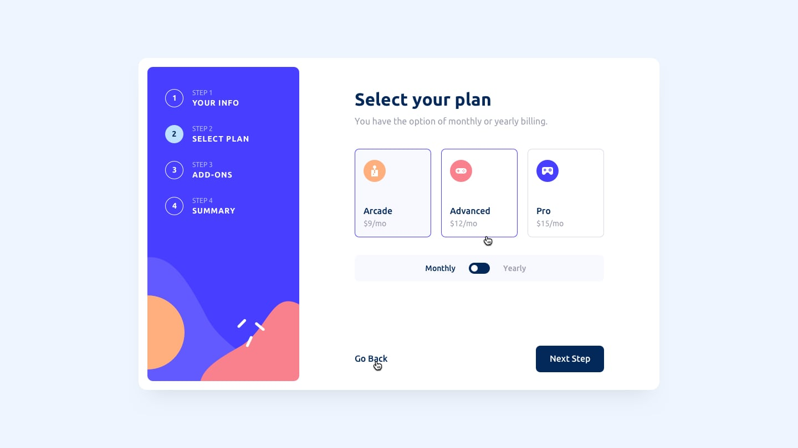

# Frontend Mentor - Multi-step form solution

This is a solution to the [Multi-step form challenge on Frontend Mentor](https://www.frontendmentor.io/challenges/multistep-form-YVAnSdqQBJ). Frontend Mentor challenges help you improve your coding skills by building realistic projects. 

## Table of contents

- [Overview](#overview)
  - [The challenge](#the-challenge)
  - [Screenshot](#screenshot)
  - [Links](#links)
- [Author](#author)

## Overview

### The challenge

Users should be able to:

- Complete each step of the sequence
- See a summary of their selections on the final step and confirm their order
- View the optimal layout for the interface depending on their device's screen size
- See hover and focus states for all interactive elements on the page

### Screenshot

## Desktop preview

## Mobile preview

### Links

- Solution URL: [https://github.com/Muhammad-RK-Isa/multi-step-form](https://github.com/Muhammad-RK-Isa/multi-step-form)
- Live Site URL: [https://muhammad-rk-isa.github.io/multi-step-form](https://muhammad-rk-isa.github.io/multi-step-form)

## Author

- Frontend Mentor - [@Muhammad-RK-Isa](https://www.frontendmentor.io/profile/Muhammad-RK-Isa)
